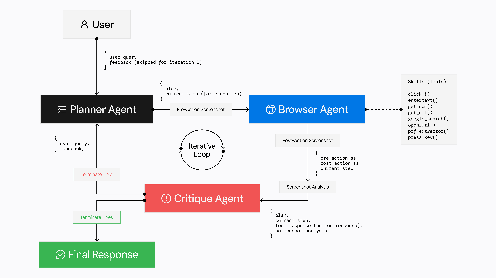

# Agentic Browser

## Table of Contents

- [Overview](#overview)
- [Features](#features)
- [Architecture](#architecture)
- [Agents Workflow](#agents-workflow)
- [Quick Start](#quick-start)
- [License](#license)
- [Acknowledgements](#acknowledgements)

## Overview

Agentic Browser is an agent-driven system that lets you control a browser using plain English. Built on the [PydanticAI Python agent framework](https://github.com/pydantic/pydantic-ai), it handles everything from filling out forms and searching e-commerce sites to pulling content, interacting with media, and managing projects across different platforms — all without writing a single line of automation code.

## Features

### Browser Automation

- **Web Research and Analysis**: Runs intelligent research across academic papers, travel sites, and code repositories using natural language queries.
- **Data Extraction**: Collects and compiles structured data — sports stats, historical records, stock prices, currency rates, and more.
- **E-commerce Information**: Scrapes product details like pricing, specifications, and availability across major e-commerce platforms.
- **Web Traversal**: Navigates across domains with context-aware logic, correlating data as it moves between sites.

## Architecture



Three specialized agents work together to handle every task:

- **Planner Agent**: The strategist. It breaks your request into clear, executable steps and adapts the plan as things progress.

- **Browser Agent**: The executor. It directly interacts with web pages — clicking, typing, navigating, and extracting information using browser automation tools.

- **Critique Agent**: The quality controller. It reviews what happened, checks the results, and decides whether the task is done or needs another pass.

Together, they run a continuous feedback loop until the task is complete.

## Agents Workflow

### Step 1: Planning Phase

- The **Planner Agent** receives your request
- Breaks down what needs to happen
- Produces a step-by-step execution plan
- Identifies the first action to take

### Step 2: Execution Phase

- The **Browser Agent** picks up the current step
- Carries out precise browser actions — navigation, clicks, text entry
- Uses DOM inspection and screenshot analysis as needed
- Reports back with results

### Step 3: Evaluation Phase

- The **Critique Agent** reviews what the Browser Agent did
- Checks screenshots and DOM changes to verify success
- Decides the next move:
  - Return results to the user if the task is done
  - Move on to the next step in the plan
  - Ask the Planner Agent to revise the plan if something went wrong

This loop continues until the task completes or a terminal condition is hit.

## Quick Start

### Setup

#### 1. Install `uv`

Agentic Browser uses `uv` to manage the Python virtual environment and dependencies.

- macOS/Linux:

  ```bash
  curl -LsSf https://astral.sh/uv/install.sh | sh
  ```

- Windows:

  ```bash
  powershell -c "irm https://astral.sh/uv/install.ps1 | iex"
  ```

  You can also install uv via pip.

#### 2. Clone the repository

    git clone https://github.com/TheAgenticAI/TheAgenticBrowser

#### 3. Set up the virtual environment

    uv venv --python=3.11
    source .venv/bin/activate
    # On Windows: .venv\Scripts\activate

#### 4. Install dependencies

    uv pip install -r requirements.txt

#### 5. Install Playwright Drivers

    playwright install

To use your local Chrome browser instead of Playwright, open `chrome://version/` in Chrome, copy the path to your profile, and set `BROWSER_STORAGE_DIR` to that path in `.env`.

#### 6. Configure the environment

Copy the example env file and fill in your values:

    cp .env.example .env

Edit `.env` and set the following:

    # AGENTIC_BROWSER Configuration
    AGENTIC_BROWSER_TEXT_MODEL=<text model name eg. "gpt-4o">
    AGENTIC_BROWSER_TEXT_API_KEY=<your text model API key>
    AGENTIC_BROWSER_TEXT_BASE_URL=<text model base url eg. "https://api.openai.com/v1">
    
    # Screenshot Analysis Configuration
    AGENTIC_BROWSER_SS_ENABLED=<true/false>
    AGENTIC_BROWSER_SS_MODEL=<screenshot model name eg. "gpt-4o">
    AGENTIC_BROWSER_SS_API_KEY=<your screenshot model API key>
    AGENTIC_BROWSER_SS_BASE_URL=<screenshot model base url eg. "https://api.openai.com/v1">

    # Logging
    LOGFIRE_TOKEN=<your logfire write token>
    
    # Google Search Configuration
    GOOGLE_API_KEY=<your Custom Search json api>
    GOOGLE_CX=<your google custom search engine id>
    
    # Browser Configuration
    BROWSER_STORAGE_DIR=<path to browser storage directory eg. "./browser_storage">
    STEEL_DEV_API_KEY=<Optional: Enable remote browser via Steel Dev CDP, (Only useful when launched as an API, see Step 7>

#### 7. Run the project

Run directly from `main.py` or spin up an API server:

- Direct:
  ```bash
  python3 -m core.main
  ```

- API:
  ```bash
  uvicorn core.server.api_routes:app --loop asyncio
  ```

  Example request:
  ```
  POST http://127.0.0.1:8000/execute_task

  {
      "command": "Give me the price of RTX 3060ti on amazon.in and give me the latest delivery date."
  }
  ```

### Running the API with Docker (for AgenticBench)

#### Ubuntu / Windows

```bash
docker build -t agentic_browser .
docker run -it --net=host --env-file .env agentic_browser
```

#### macOS

```bash
docker build -t agentic_browser .
docker run -it -p 8000:8000 --env-file .env agentic_browser
```

## Acknowledgements

- [Agent-E](https://github.com/EmergenceAI/Agent-E?tab=readme-ov-file)
- [PydanticAI Python Agent Framework](https://github.com/pydantic/pydantic-ai)